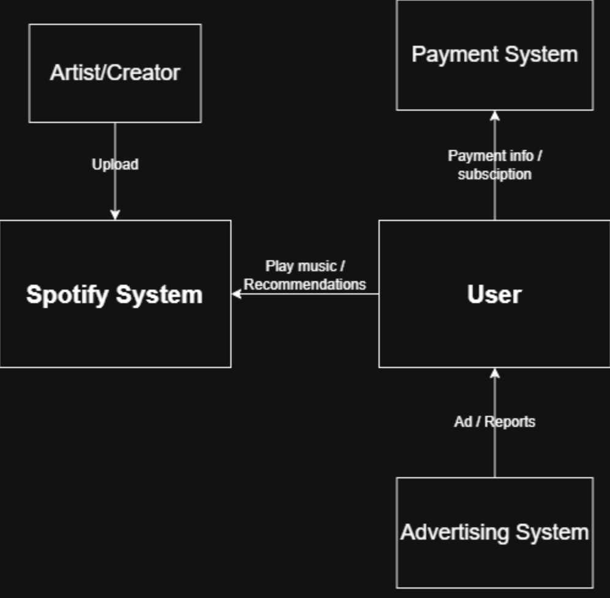

# Spotify System Analysis

## 1. สมาชิกกลุ่ม
- 67543210005-4 นางสาวสาริศา ถวัลย์วราศักดิ์  
- 67543210006-2 นายเจษฏา อินตา  
- 67543210013-8 นายจักรภัทร พรมทา  

---

## 2. ระบบที่เลือก (Target System)
- **ชื่อระบบ:** Spotify  
- **ประเภทระบบ:** Streaming (Video/Music)  
- **เหตุผลที่เลือกระบบนี้:**  
  เนื่องจากภายในกลุ่มมีความคุ้นเคยกับระบบ Streaming ดังกล่าวกันทุกคน และใช้งานต่อเนื่องเป็นเวลานาน จึงเข้าใจการทำงานของระบบพอสมควร เรียกได้ว่าเป็นแฟนตัวยงของแอปนี้

---

## 3. Actors / Users ที่เกี่ยวข้อง

| ลำดับ | ชื่อ Actor / User Type | บทบาท/หน้าที่หลัก | ตัวอย่างการใช้งานระบบ |
|-------|----------------------|-----------------|------------------|
| 1 | Listener / End User | ฟังเพลง, ค้นหาเพลง, สร้างเพลย์ลิสต์ | เปิดเพลงโปรด, ค้นหาเพลงใหม่ |
| 2 | Free User | ใช้ระบบแบบมีโฆษณาและจำกัดการข้ามเพลง | ฟังเพลงพร้อมโฆษณา |
| 3 | Premium User | ใช้งานแบบไม่มีโฆษณา, เล่นออฟไลน์, คุณภาพสูง | สมัคร Premium และดาวน์โหลดเพลง |
| 4 | Artist / Creator | อัปโหลดเพลง, ดูสถิติ, จัดการคอนเทนต์เพลง | ปล่อยอัลบั้มใหม่และตรวจสอบยอดสตรีม |
| 5 | Label / Distributor | ส่งเพลงของค่ายเข้าสู่ระบบ Spotify | อัปโหลดไฟล์เพลงของศิลปินในสังกัด |
| 6 | Advertiser | ลงโฆษณาเพื่อโปรโมตสินค้า/เพลง | สร้างแคมเปญโฆษณาใน Spotify Ads |
| 7 | Admin | ตรวจสอบเนื้อหา, จัดการลิขสิทธิ์, ดูแลระบบหลังบ้าน | ลบเพลงละเมิดลิขสิทธิ์, แก้ไขข้อมูลศิลปิน |
| 8 | Support Agent | ให้บริการช่วยเหลือผู้ใช้งาน | ตอบคำถามปัญหาการชำระเงินหรือบัญชี |
| 9 | Analytics Team | วิเคราะห์ข้อมูลผู้ฟังและแนวโน้มเพลง | สร้างรายงานยอดสตรีม/รายได้ |

---

## 4. External Systems / Services

| ลำดับ | ชื่อ External System / Service | ทำหน้าที่ | ตัวอย่างการโต้ตอบกับระบบของเรา |
|-------|------------------------------|-----------|--------------------------------|
| 1 | Payment Gateway (Stripe, PayPal ฯลฯ) | ประมวลผลการชำระเงิน Premium | Spotify ส่งคำสั่งตัดบัตร → Gateway ยืนยันการชำระ |
| 2 | Bank API | ตัดเงินรายเดือน, คืนเงิน หรือเช็คสถานะ | ระบบ Premium Billing → Bank API เช็คสถานะการตัดเงิน |
| 3 | Google / Facebook / Apple Login | ใช้ทำ Social Login | ผู้ใช้กด Login with Google → ยืนยัน Token |
| 4 | CDN (Content Delivery Network) | กระจายไฟล์เพลงและรูปภาพให้โหลดเร็ว | ผู้ใช้เปิดเพลง → ไฟล์ถูกดึงจาก CDN ใกล้ที่สุด |
| 5 | Music Rights Management (Merlin, DDEX) | ตรวจสอบลิขสิทธิ์เพลง | Spotify เช็ก metadata เพลงกับระบบลิขสิทธิ์ |
| 6 | Ad Network / Ad Delivery System | แสดงโฆษณาให้ผู้ใช้ฟรี | Spotify ขอชุดโฆษณา → Ad Server ส่งโฆษณากลับมา |
| 7 | Machine Learning Services | แนะนำเพลง เช่น Discover Weekly | ระบบ Recommendation ดึงผลลัพธ์จาก ML Models |
| 8 | Analytics / Logging Services (BigQuery, Datadog ฯลฯ) | เก็บข้อมูลผู้ใช้และระบบ | Spotify ส่ง Event สตรีมเพลงไปเก็บใน Analytics |
| 9 | Notification Service (Firebase, APNs) | ส่งการแจ้งเตือนมือถือ | ระบบส่ง Notification → FCM/APNs ส่งถึงผู้ใช้ |
| 10 | Email Service (SendGrid, AWS SES) | ส่งอีเมลแจ้งเตือนและใบเสร็จ | ส่งใบเสร็จ Premium ผ่านระบบ Email |
| 11 | Smart Speaker Integrations (Alexa, Google Home) | เชื่อมต่อควบคุมเพลงด้วยเสียง | ผู้ใช้พูด “Play music on Spotify” → อุปกรณ์เรียก API |
| 12 | Social Sharing APIs | แชร์เพลงไปยัง Social Media | กด Share เพลง → ส่งข้อมูลไปยัง Instagram/Twitter |
| 13 | Device Authentication System | จัดการหลายอุปกรณ์ที่ล็อกอิน Spotify | ยืนยันว่าอุปกรณ์ใหม่สามารถฟังเพลงได้ |

---

## 5. ขอบเขตของระบบ (System Scope)
ระบบที่กลุ่มเลือกมานับรวม **Mobile App, Web App, Desktop App และ Backend** ทุกแพลตฟอร์มที่ Spotify ให้บริการ ซึ่งการใช้งานจะเหมือนกันทั้ง 3 แพลตฟอร์ม ผู้ใช้ที่เคยใช้งานบนแพลตฟอร์มใดก็จะสามารถคุ้นเคยกับอีกแพลตฟอร์มโดยปริยาย

---

## 6. System Context Diagram

---

## 7. สรุปผลการวิเคราะห์
- องค์ประกอบสำคัญที่มีผลต่อประสิทธิภาพและความสำเร็จ:
  - **CDN**: กระจายไฟล์เพลง  
  - **Payment Gateway / Bank API**: จัดการรายได้  
  - **Machine Learning Services**: ระบบแนะนำเพลง  
  - **Music Rights Management**: จัดการลิขสิทธิ์  
- ก่อนหน้านี้กลุ่มลืมวิเคราะห์:  
  - **Support Agent** และ **Analytics Team** (Actors)  
  - **Smart Speaker Integrations, Social Sharing APIs, Notification Services, Device Authentication System** (External Systems)  
  ซึ่งมีความสำคัญต่อ **User Experience** และ **การขยายฐานผู้ใช้**  
- ปัญหา/คอขวดที่อาจเกิดขึ้นเมื่อผู้ใช้และโหลดเพิ่ม:
  - **CDN**: bandwidth ไม่เพียงพอ  
  - **Database**: query ช้าลง  
  - **ML Services**: ใช้ทรัพยากรสูง  
  - **Payment Gateway**: จำกัด transaction rate  
  - **Authentication System**: login พร้อมกันมาก  
  - **Ad Delivery System**: ส่งโฆษณาไม่ทัน  
- วิธีแก้ไข:
  - ใช้ **Horizontal/Vertical Scaling**  
  - ใช้ **Caching** อย่างมีประสิทธิภาพ

## 8. Presentation
**[Ours Presentation](https://www.canva.com/design/DAG5heExRY8/Uzs5MlLnqgE1cjotYKCHxA/view?utm_content=DAG5heExRY8&utm_campaign=designshare&utm_medium=link2&utm_source=uniquelinks&utlId=hc6eb70256a)**
